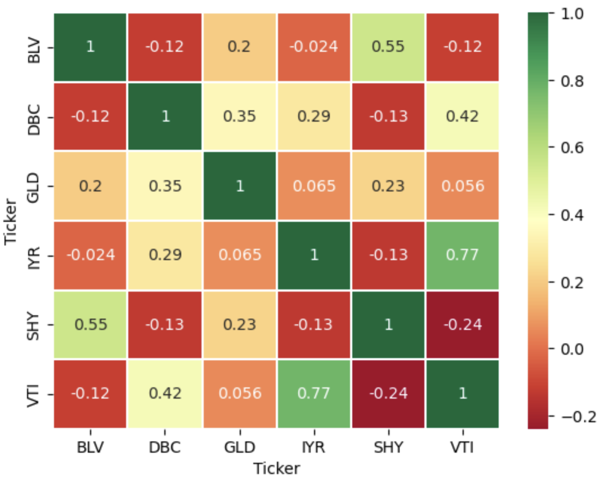
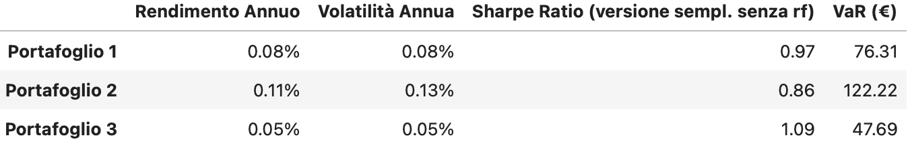

# 📈 Portfolio Optimization & Risk Analysis with Python (PyPortfolioOpt + VaR)

Questo progetto implementa un’analisi completa di portafogli finanziari utilizzando Python, con:
- Ottimizzazioni tramite **PyPortfolioOpt**
- Analisi storica dei rendimenti tramite **yfinance**
- Calcolo del **VaR a 95%**
- Metriche di rischio/rendimento (Sharpe, volatilità, rendimento annuo)
- Visualizzazioni (heatmap, grafici cumulativi)
- Comparazione tra tre portafogli ottimizzati

---

## 🚀 Obiettivi del progetto

Il progetto ha tre obiettivi principali:

1. **Scaricare e analizzare serie storiche** di ETF diversificati.  
2. **Costruire tre portafogli ottimizzati**:
   - 🔵 *Portafoglio 1:* rendimento target 7%  
   - 🟢 *Portafoglio 2:* rendimento target 10%  
   - 🟣 *Portafoglio 3:* rischio target 5%  
3. **Valutare le performance** con:
   - Rendimento annuo
   - Volatilità annualizzata
   - Sharpe ratio
   - **Value at Risk (VaR) a 10.000€**

---

## 📊 ETF analizzati

| Ticker | Asset Class |
|--------|-------------|
| **VTI** | Azionario USA totale |
| **SHY** | T-bills / obbligazioni breve termine |
| **BLV** | Obbligazionario long-term |
| **GLD** | Oro |
| **DBC** | Commodities |
| **IYR** | Real estate (REIT USA) |

---

## 📚 Librerie utilizzate

- `yfinance`
- `pandas`
- `numpy`
- `matplotlib`
- `seaborn`
- `PyPortfolioOpt`

Installazione:

```bash
pip install yfinance pandas numpy matplotlib seaborn PyPortfolioOpt

## Output del codice: Matrice di Correlazione degli Asset e Tabella Riassuntiva



## Author
Raoul Alessandro Baciu
Master's student in Economics and Finance at Ca' Foscari
[Linkedin](www.linkedin.com/in/raoul-alessandro-baciu-12004b236)
